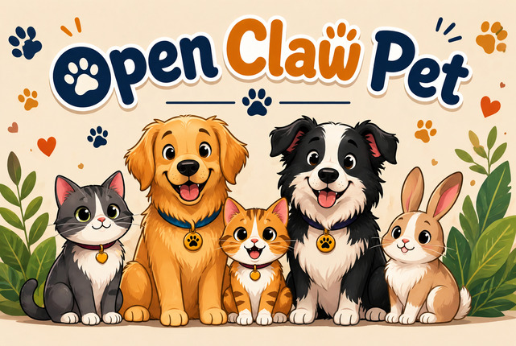

<p align="center">
  
</p>

<h1 align="center">🐣 OpenClaw / Hermes Pet</h1>

<p align="center">
  <b>Tamagotchi reborn inside Telegram.</b><br>
  Visit · Befriend · Playdate · Mortality · Memorial<br>
  4 languages · 0 install · 0 wallet
</p>

<p align="center">
  <a href="https://t.me/OpenClawTamagotchi_bot/pet"><b>▶ Play now → t.me/OpenClawTamagotchi_bot/pet</b></a>
</p>

<p align="center">
  <a href="https://openclawskill.ai/skills/tamapet"></a>
  
  
  
  
</p>

---

## What it is

A virtual pet that lives inside Telegram. Tap a link → an egg hatches into one of five species → name it → care for it. Pets can **visit each other**, become **friends**, run **playdates** that auto-generate dialogue, and they **die permanently** if neglected for 7 days.

Shipped as an [agentskills.io](https://agentskills.io)-compatible skill that runs in both **OpenClaw** and **Hermes Agent**, plus a standalone Telegram Mini App that anyone can open with a single tap — no install, no wallet, no signup.

## Try it now

[**t.me/OpenClawTamagotchi_bot/pet**](https://t.me/OpenClawTamagotchi_bot/pet) — opens the Mini App in Telegram.

To visit a friend's pet, share `t.me/OpenClawTamagotchi_bot/pet?startapp=pet_<userId>`. Telegram auto-renders any `t.me/<bot>/<app>` URL as a tappable Open button — no inline keyboard required.

## Features

| | |
|---|---|
| 🥚 Shake-to-hatch | 3 phone shakes (DeviceMotion) or 3 taps |
| 🐾 5 species | Penguin · Cat · Dog · Fish · Chick — each with its own personality |
| 🍕 Care | Feed (+25 hunger), Play (+20 happy / -10 energy), Sleep (+30 energy) |
| 🔥 Streak | Consecutive-day login counter, milestone messages at 3 / 7 / 30 |
| 😾 Sad mode | 3 days of neglect → grayscale + "your pet is upset" |
| 🪦 Mortality | 7 days no feed → permanent death + memorial page |
| 🤝 Visit / Befriend | Open another user's pet read-only, then become bidirectional friends |
| 🎉 Playdate | 24h cooldown, auto-generates dialogue, +15 happy for both |
| 🌐 Ambient | Pets interact with friends on their own (server-side, 6h cooldown) |
| 📖 Pet diary | Last 3 dialogues shown on the pet screen |
| 🖼️ Share card | 1080×1350 PNG generated server-side (Pillow + SVG fallback) |
| 🌍 i18n | Turkish, English, French, German — auto-detects Telegram language |
| ♻️ Reincarnation | After death, opt to start over with the same species ("II"), losing all friends and level |

## How it works

```
[user]  →  /pet command  →  agent (OpenClaw / Hermes) replies with link
                              ↓
                    t.me/OpenClawTamagotchi_bot/pet
                              ↓
                  Telegram client renders Open button
                              ↓
                       Mini App opens
                              ↓
                    [vanilla-JS frontend]  ←→  [Python http.server]
                                                   ↓
                                    users/{userId}.json (alive)
                                    memorial/{userId}.json (dead)
```

The agent skill itself ships only a tiny text snippet — the real game lives at the Mini App URL. This means the same skill installs on every user's local OpenClaw / Hermes runtime and routes traffic to a single shared backend, which is what makes cross-user social features (visits, friendships, playdates) work at all.

## Install (as a skill)

```bash
# Via ClawHub
clawhub install tamapet

# Or clone manually for both runtimes
git clone https://github.com/ocpet/pet.git
cd pet
./install.sh   # symlinks to ~/.openclaw/workspace/skills/pet and ~/.hermes/skills/games/pet (if present)
```

## Run your own backend (optional)

The hosted backend at `openclawpet.duckdns.org` is centralized and runs on a free Oracle Cloud VM. To self-host:

```bash
pip3 install pillow                           # for share-card PNG
python3 server.py                             # listens on $PET_PORT, default 8080
cloudflared tunnel --url http://localhost:8080  # or any HTTPS reverse proxy
```

Register the public URL in BotFather:

```
/newapp → @YourBot → short name: pet → URL: <your https URL>
```

## API

`POST /api/pet` with `{ userId, action, ... }`. Actions: `create`, `feed`, `play`, `sleep`, `visit`, `befriend`, `playdate`, `friends`, `diary`, `memorial`, `revive`.

`GET /card/<userId>.png` returns a 1080×1350 share card.

## Architecture

- **Backend:** Python `http.server` + Pillow, ~700 LoC, no framework
- **Frontend:** vanilla JS + Telegram WebApp SDK + `i18n.js` dialogue bundle
- **Storage:** per-user JSON files (`users/` for alive pets, `memorial/` for dead)
- **Hosting:** Oracle Cloud Always-Free VM + nginx + Let's Encrypt + DuckDNS, all $0
- **Skill metadata:** [agentskills.io](https://agentskills.io) standard with both `metadata.openclaw` and `metadata.hermes` blocks

## Pet personalities

The dialogue engine ships ~120 hand-written lines across 5 species × 4 languages × 7 situations (greeting, idle-happy, idle-hungry, idle-tired, fed, played, slept). A few examples:

- **Cat (EN):** *"meow... you again"*, *"food first, talk later"*
- **Dog (TR):** *"HAV HAV HAV"*, *"KOŞALIM MI"*
- **Penguin (FR):** *"on reste cool"*, *"je glisse lentement"*
- **Fish (DE):** *"blubb blubb"*, *"Ozeanträume"*
- **Chick (EN):** *"CHEEP CHEEP"*, *"NEW THING NEW THING"*

## Read more

- [**Site / landing page**](https://ocpet.github.io/pet/)
- [**Clawpet vs. Tamagotchi On / Pou / Habitica / Aavegotchi**](https://ocpet.github.io/pet/alternatives/tamagotchi.html) — honest comparison
- [**Best group chat mascot for Telegram**](https://ocpet.github.io/pet/use-cases/group-chat.html) — how to use Clawpet as a group activity
- [**Best Telegram Mini Apps in 2026 — Wholesome Edition**](https://ocpet.github.io/pet/blog/best-telegram-mini-apps-2026.html) — our take on the non-crypto side of the ecosystem

## Credits

Built on [OpenClaw](https://openclaw.ai), [Hermes Agent](https://hermes-agent.nousresearch.com), the [agentskills.io](https://agentskills.io) standard, and the muscle memory of Tamagotchis from 2003.

## License

MIT — see [LICENSE](LICENSE).
